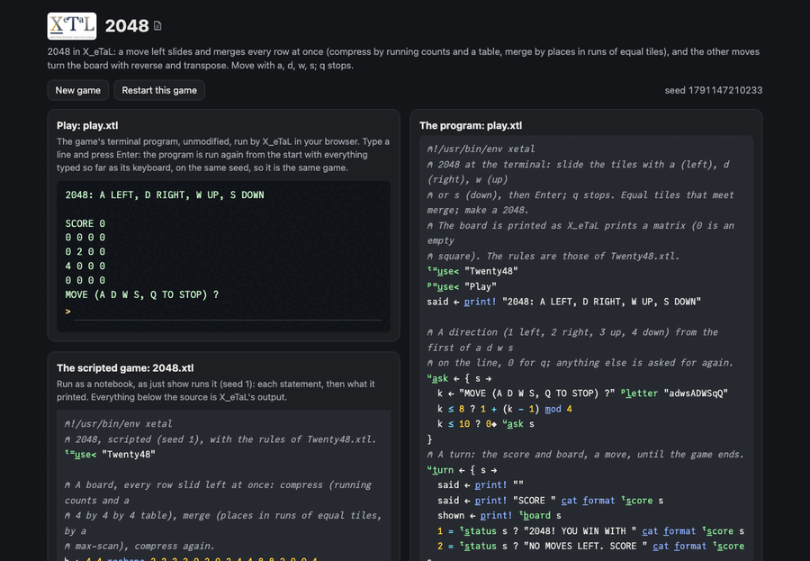

# 2048

Slide the tiles of a 4 by 4 board left, right, up or down; two equal
tiles that meet merge into their sum, and a 2 (sometimes a 4) appears
on an empty square. Make a 2048 tile; the game ends when no move
changes the board.

In X_eTaL a move left is three steps applied to every row at once:
compress (slide the tiles together), merge (equal neighbours, left to
right), compress again. The other three moves turn the board so that
the move is left (reverse the rows, transpose), move left, and turn
it back.

Live: [the 2048 page](https://softwarewrighter.github.io/X_eTaL-games/2048/)
-- the game (`play.xtl`) in a terminal, the scripted game (`2048.xtl`)
as a notebook, and the sources: everything on the page is X_eTaL's own
output, run in your browser.



## The program

`play.xtl` imports the rules as `t:`; each turn prints the score and
the board (as X_eTaL prints a matrix, 0 an empty square) and moves:

```
"t:" u_se< "Twenty48"
u:t_urn := { s ->
  shown := p_rint! t:b_oard s
  1 = t:s_tatus s ? "2048! YOU WIN WITH " c_at f_ormat t:s_core s
  2 = t:s_tatus s ? "NO MOVES LEFT. SCORE " c_at f_ormat t:s_core s
  d := u:a_sk s
  0 = d ? "STOPPED WITH SCORE " c_at f_ormat t:s_core s
  next := s t:m_ove d
  next m_atch s ? u:t_urn u:s_tuck s; u:t_urn next
}
```

## The rules: a library

`Twenty48.xtl` (exports named `l:`, seen as `t:`):

```
l:c_ompress := { b ->
  c := (b != 0) * '+ s_\_2 b != 0
  '+ r_/_2 (b 'l_eft t_able r_ange 4) * c '= t_able r_ange 4
}
l:p_lace := { b ->
  j := 4 4 r_eshape r_ange 4
  prev := 0 c_at_2 -1 d_rop_2 b
  1 + j - 'm_ax s_\_2 j * b != prev
}
l:l_eft := [l:c_ompress [l:m_erge l:c_ompress]]
l:t_urn := { b d -> (1 * d m_ember? 2 4) 'r_ev_2 p_ower (1 * d m_ember? 3 4) 'o_\ p_ower b }
l:s_lide := { b d -> (l:l_eft b l:t_urn d) l:b_ack d }
```

## How it works

- Compress: `'+ s_\_2 b != 0` counts the tiles in each row up to each
  square: a tile's new column. A 4 by 4 by 4 table of every square
  against every column (row, old column, new column) holds each tile's
  value where it lands; summed over the old columns it is the slid
  board.
- Merge: a run of equal tiles starts where a tile differs from the
  one before; the latest start so far is a max-scan (`'m_ax s_\_2`), so
  every tile's place in its run is one subtraction. A tile in an odd
  place doubles when the next tile is equal; one in an even place was
  absorbed. `[2 2 2 2]` gives places 1 2 3 4: 4 4.
- A move left is a train of atops, `[l:c_ompress [l:m_erge
  l:c_ompress]]`: compress, then merge, then compress.
- The other moves turn the board: up and down transpose it (`o_\`)
  once, right and down reverse its rows (`r_ev_2`) once, each written
  as a power of 0 or 1 (`p_ower`); move left; turn back in the other
  order.
- The score gains every tile made by merging; a game ends when none of
  the four moves changes the board (`m_atch`).
- The board is text: `[]G_RID` cannot yet draw numbers in its cells
  (asked for in `docs/xetal-asks.md`).

## Play it

```bash
just play 2048        # at the terminal
just run 2048         # the scripted game, with a corner player
just show 2048        # the scripted game as a notebook
just repl 2048        # then "t:" u_se< "Twenty48"
just test-game 2048   # compare with the expected output
```

## Assets

None.

## Workarounds

Boards of numbers are printed as text: `[]G_RID` draws numbers as
colours without the numbers (see `docs/xetal-asks.md`).
