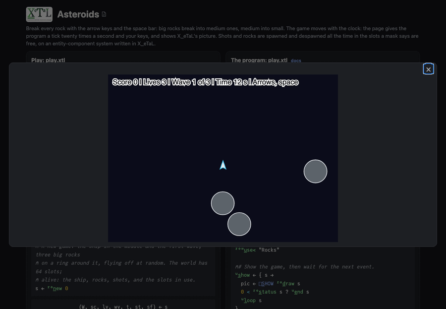

# Asteroids

Break every rock, three waves of them. Left and right (or `a` and `d`)
turn the ship, up (or `w`) thrusts, the space bar (or `f`) fires. A big
rock breaks into two medium ones, a medium into two small, a small one
is gone. A rock that hits the ship costs one of three lives (the ship
then starts again in the middle, faint and safe for two seconds). The
field wraps around at its edges. `r` starts again. The game moves with
the clock, twenty ticks a second.

Built on [`lib/Ecs`](../../lib/README.md), an entity-component system
written in X_eTaL as arrays.

Live: [the Asteroids page](https://softwarewrighter.github.io/X_eTaL-games/asteroids/)
-- Play opens the game in a dialog (close it with Escape, its X or a
click outside) and starts the clock;
[this link](https://softwarewrighter.github.io/X_eTaL-games/asteroids/#play)
opens it at once. When the game ends, Play or any key starts a new one.



## How it works

- **Entities come and go, and masks keep track.** Every shot is spawned
  when fired and despawned when spent; every rock hit is despawned and
  its two halves spawned. The world is a matrix of 64 slots, and column
  1 says which hold a living entity: `ec:s_pawn` takes the first free
  slots (the ones just freed among them), `ec:d_espawn` clears rows.
  What each slot holds (ship, rock, shot) is a mask too, so no list of
  rocks or shots is kept anywhere.
- **Every rule is a system over every entity at once.** A tick
  (`l:t_ick`): everything moves by its speed and wraps around; the shots
  age and the spent ones go; every shot is checked against every rock at
  once (a table, shots down, rocks across, each rock's radius from its
  size), the shots that hit are spent and the rocks hit break; a rock
  that reaches the ship costs a life; a cleared field brings the next
  wave.
- **Breaking is arithmetic on rows.** The rocks hit that are bigger than
  small are each repeated twice (`r_eplicate` with counts of 2), turned
  0.7 radians left and right of their way by one rotation formula over
  all of them, and spawned a size smaller.
- **The game is data.** `asteroids.toml` holds the field, the waves, the
  rocks' radii, speeds and points by size, the ship's numbers and the
  gun's. `test.sh` plays a copy with one wave of one rock: a gunner that
  turns to the nearest rock and fires breaks it into 2 and then 4 pieces
  and clears the field for exactly 520 points.
- **The state is a tuple:** `(world, score, lives, wave, seconds,
  standing, safe)`.
- The clock's ticks and your keys come to `play.xtl` as `[]E_VENT`
  events (`tick 0.05`, `key LEFT`, `key space`), on the page as at the
  command line.

From `Rocks.xtl`, every shot against every rock:

```
dx := (1 s_elect_2 P) '- t_able 1 s_elect_2 R
dy := (2 s_elect_2 P) '- t_able 2 s_elect_2 R
reach := more + (f_loor r s_elect h:s_ize W) s_elect RADII
((dx * dx) + dy * dy) < (s_hape dx) r_eshape reach * reach
```

## Play it

```bash
just show asteroids       # the scripted game as a notebook
just play asteroids       # at the terminal: lines such as tick 0.05 and key space
just test-game asteroids  # compare with the expected output
```

At the terminal nothing moves until you type a `tick` line; the page
gives the ticks. The expected game (`expected/play.in`) is fifteen
seconds of a gunner that turns to the nearest rock and fires.

## Assets

None.
