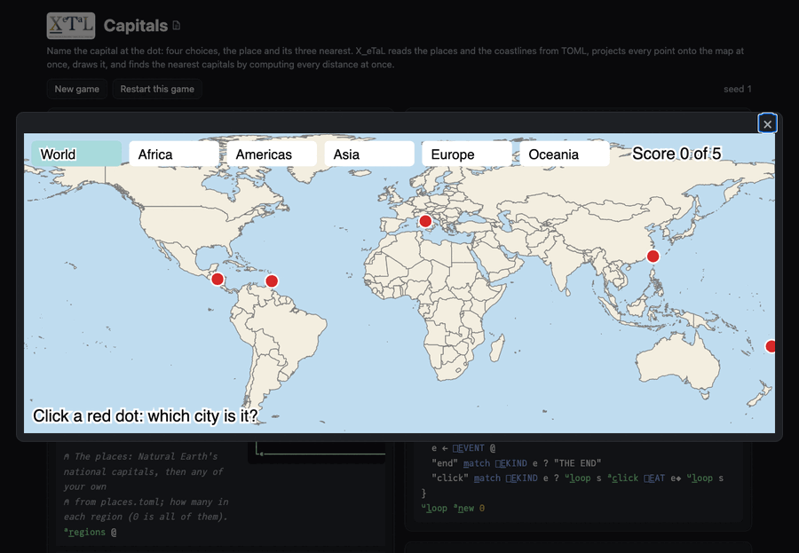

# Capitals

A map you click. Each round puts five red dots on the map, each a
national capital inside its country, with no names on the map. Click a
dot: a menu of four city names opens beside it, the right one and the
nearest other cities. Click a name: the dot turns green (right) or
orange (wrong) and is labeled with its city, and the score goes up when
you are right. The buttons along the top start a round in a region
(Africa, Americas, Asia, Europe, Oceania), zoomed to it, or in the
whole world.

Live: [the Capitals page](https://softwarewrighter.github.io/X_eTaL-games/capitals/)
-- Play opens the map in a large dialog (close it with Escape, its X or
a click outside); [this link](https://softwarewrighter.github.io/X_eTaL-games/capitals/#play)
opens it at once. Below the dialog are the scripted game (`capitals.xtl`)
as a notebook, and the sources.



## How it works

Everything on the map is written by X_eTaL, in `Atlas.xtl`; the page
shows the picture and passes your clicks to the program.

- **The data is TOML.** `[]T_ABLE` reads the capitals (name, latitude,
  longitude, region) and the cities (name, latitude, longitude) as
  matrices of texts, and `[]L_IST` the country outlines; numbers are
  texts in TOML, read with `n_umbers`. Your own places in `places.toml`
  are joined to them with `c_at`.
- **The map is SVG text.** The outlines (path data in degrees) go under
  a transform that is the projection (the plate carree: map units are
  hundredths of a degree east of 180 W and south of the pole); every
  dot, button, label and menu is placed in map units by X_eTaL and
  written with `f_ormat<`; the pieces are joined with `t:j_oin` (in
  pairs, level by level, as X_eTaL has no join built-in yet).
- **The view.** For a region, the box around its capitals with a
  margin, widened to the map's shape; the buttons, dots and text are
  sized to the view, so they look the same at every zoom.
- **The choices.** `l:c_lose` gives the cosine of the angle at the
  Earth's center between a capital and every city at once (the
  spherical law of cosines); `g_rade` of its negation orders the cities
  nearest first. The first four with different names, west to east,
  are the choices; the nearest is the capital itself, the answer.
- **The clicks.** `play.xtl` is an event loop: it shows the picture,
  reads the next event with `[]E_VENT`, and gives a click's point to
  `l:c_lick`, which tests it against the same rectangles and dots the
  picture was drawn with: a region button starts a round, a menu choice
  answers, a dot opens its menu. On the page each click is the line
  `click X Y` in map units, and the program is run again from the start
  with every click so far, so a game replays exactly.

From `Atlas.xtl`:

```
l:c_hoices := { i ->
  o := 12 t_ake g_rade n_eg l:c_lose i
  nm := '{ k -> e_nclose l:t_own k } e_ach o
  c := 4 t_ake ((nm i_ndexOf nm) = r_ange t_ally nm) r_eplicate o
  (g_rade c s_elect tlon) s_elect c
}
```

## Play it

```bash
just show capitals       # the scripted game as a notebook (a round played by clicks)
just play capitals       # at the terminal: type lines such as click 30157 6496 (map units)
just repl capitals       # then "a:" u_se< "Atlas"
just test-game capitals  # compare with the expected output
```

The page is the way to play; the terminal takes the same events typed
as lines (the golden session, `expected/play.in`, is one).

## Adding places

Add places of your own to `places.toml`: list each key in `places`
and give it a table with its name ("City, Country"), latitude,
longitude (degrees, south and west negative) and region. The file's
comment shows an example, and `test.sh` checks that added places join
the game, with their own name among their choices. The regions menu is
the `regions` list in the same file.

## Assets

`assets/fetch.sh` downloads Natural Earth's 1:50m countries and
populated places (public domain, pinned to a commit and checked by
SHA-256) into the git-ignored `assets/cache/`, and `assets/convert.py`
writes `assets/cache/world.toml`: each country's outline as SVG path
data in degrees (points closer than 0.2 degree dropped), each national
capital's name, latitude, longitude and its country's UN region, and
every city's name, latitude and longitude. Nothing is projected or
drawn there.

## Known limits

- Oceania crosses the date line, so its view spans nearly the whole
  width of the map.
- Each click runs the program again from the start (as every page here
  replays its input), so a long game slows down; X_eTaL's terminal pane
  and resumable runs will end that.

## Workarounds

All named in [`docs/xetal-asks.md`](../../docs/xetal-asks.md):

- Joining many texts uses `t:j_oin` (pairs, level by level): a reduce
  with `c_at` copies the growing text each time, and X_eTaL has no join
  (raze) built-in yet.
- Numbers are strings in TOML (X_eTaL's data-only `.xtln` would carry
  them as numbers), read with `n_umbers` one short string at a time.
- The data files are named relative to the game's directory, where
  every recipe runs the programs: `[]T_ABLE` reads paths relative to
  the working directory.
