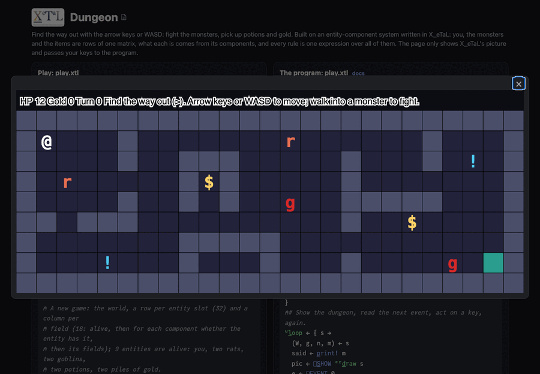

# Dungeon

Find the way out (`>`) with the arrow keys or WASD. Walk into a monster
to fight it; rats and goblins come after you when they see you. Walk
over potions (`!`) and gold (`$`) to pick them up. `r` starts again.

The first game built on [`lib/Ecs`](../../lib/README.md), an
entity-component system written in X_eTaL as arrays.

Live: [the Dungeon page](https://softwarewrighter.github.io/X_eTaL-games/dungeon/)
-- Play opens the dungeon in a dialog (close it with Escape, its X or a
click outside); [this link](https://softwarewrighter.github.io/X_eTaL-games/dungeon/#play)
opens it at once.



## How it works

- **The world is a matrix.** A row per entity (you, each monster, each
  item), a column per field. `"h" ec:c_omponents< "pos:2 hp atk kind
  chase heal gold player"` (the macro in `lib/Ecs.xtlm`) writes the
  layout when the program is compiled: for each component a getter, a
  mask, a setter and a remover.
- **What an entity is comes from its components.** A rat has hit
  points, attack, chase and gold (dropped when beaten); a potion only
  heal. `dungeon.toml` gives each kind its components, and nothing in
  the code names a kind: a new kind of monster or item is a table there.
  `test.sh` adds bats to a copy of the data and checks they spawn and
  chase with no code changed.
- **Every rule is a system over every entity at once.** A turn
  (`l:t_urn`): you move or hit what is in the way; what lies where you
  stand is picked up; beaten monsters drop their gold and go; every
  monster that sees you comes a step closer, all at once (not into a
  wall, another monster, or the same cell as another), or hits you when
  next to you.
- **The state is a tuple:** `(world, gold, turns, what happened)`.
- Keys come to `play.xtl` as `[]E_VENT` events (`key UP`), on the page
  as in the terminal.

From `Crawl.xtl`, the monsters' step, every monster at once:

```
rowFirst := (a_bs 1 s_elect_2 d) >= a_bs 2 s_elect_2 d
step := o_\ (2 c_at t_ally ms) r_eshape (rowFirst * h:s_ign 1 s_elect_2 d) c_at (n_ot rowFirst) * h:s_ign 2 s_elect_2 d
```

## Play it

```bash
just show dungeon       # the scripted game as a notebook
just play dungeon       # at the terminal: lines such as key UP
just test-game dungeon  # compare with the expected output
```

## Changing the dungeon

`dungeon.toml` holds the map (25 by 9: `#` wall, `.` floor, `+` door,
`>` the way out, `@` you, a kind's glyph for one of that kind), your hit
points and attack, and each kind's components. Add a kind by adding its
table, its name to `kinds`, and its glyph to the map.

## Assets

None.
