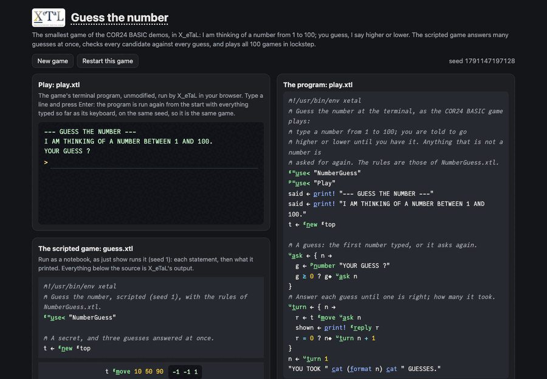

# Guess the number

The computer thinks of a number from 1 to 100; you guess, and it says
higher or lower until you have it. It is the smallest game of the
COR24 BASIC demos, and in X_eTaL it still has an array idea in it:
the answer rule works item by item, so one expression answers any
number of guesses, or checks every candidate from 1 to 100 against
every guess at once, or plays all 100 possible games in lockstep.

Live: [the guess-the-number page](https://softwarewrighter.github.io/X_eTaL-games/guess/)
-- a terminal running the same `play.xtl` as the command line, the
scripted games (`guess.xtl`) as a notebook, and the sources:
everything on the page is X_eTaL's own output, run in your browser.



## The program

`play.xtl`, the terminal game, imports the rules as `g:`:

```
"g:" u_se< "NumberGuess"
t := g:n_ew g:top
u:t_urn := { n ->
  r := t g:m_ove u:a_sk n
  shown := p_rint! g:r_eply r
  r = 0 ? n; u:t_urn n + 1
}
```

(`u:a_sk` reads a line with `[]R_EAD` and asks again until it holds a
number.)

## The rules: a library

`NumberGuess.xtl` (exports named `l:`, seen as `g:` by importers):

```
l:n_ew := { n -> r_oll! n }
l:m_ove := { t g -> (g > t) - g < t }
l:p_ossible := { t gs ->
  m := (r_ange l:top) 'l:m_ove t_able gs
  '& r_/_2 m = (s_hape m) r_eshape l:top 'r_ight t_able t l:m_ove gs
}
```

## How it works

- `(g > t) - g < t`: read right to left, `g < t` is 1 when the secret
  is higher; `g > t` is 1 when it is lower; their difference is -1, 0
  or 1. Nothing in it is scalar-only: `t g:m_ove 10 50 90` answers
  three guesses at once.
- `l:p_ossible`: `t_able` applies the answer rule to every candidate
  (rows, 100) and every guess (columns): a 100 by k table of the
  answers each candidate would have got. A second table repeats the
  answers the real secret got down all 100 rows; `=` compares the two
  tables cell by cell, and `'& r_/_2` keeps a row only if all of its
  cells agree. The result is a 0/1 mask of the secrets still possible
  (`guess.xtl` prints them with `w_here`).
- The scripted `guess.xtl` also plays every game at once: the halving
  player's state is a 3 by 100 matrix (each secret's low and high ends
  and its count of wrong guesses), narrowed seven times by
  `p_ower`. It shows 1, 2, 4, 8, 16, 32 and 37 games won in 1 to 7
  guesses: the levels of a binary search tree.

## Play it

```bash
just play guess          # at the terminal
just run guess           # the scripted games, the halving player
just show guess          # the scripted games as a notebook
just test-game guess     # compare with the expected output
```

## Sources

A port of
[`guess.bas`](https://github.com/sw-embed/web-sw-cor24-basic/blob/36569ac624921861122b199a165212710c2f0a2f/examples/guess.bas) and
[`guess-random.bas`](https://github.com/sw-embed/web-sw-cor24-basic/blob/36569ac624921861122b199a165212710c2f0a2f/examples/guess-random.bas)
from the COR24 BASIC live demos
([sw-embed/web-sw-cor24-basic](https://github.com/sw-embed/web-sw-cor24-basic),
MIT; the links are to the versions ported). The BASIC loops on line numbers:

```
130 INPUT "YOUR GUESS "; G
140 IF G = T THEN GOTO 200
150 IF G < T THEN PRINT "HIGHER!"
160 IF G > T THEN PRINT "LOWER!"
170 GOTO 130
```

The X_eTaL turn is a recursive function; lines 140 to 160 become the
one answer rule and a table of replies. `guess.bas` fixes the secret
at 42 and `guess-random.bas` seeds a generator from the time you take
to press Enter; here the secret is `r_oll! 100`, seeded by the
command line (`--seed`) or, on the page, by the clock.

## Assets

None.

## Workarounds

None. (`n_umbers` stops with an error on a line that is not a number,
so `play.xtl` keeps only digits and spaces before reading one.)
