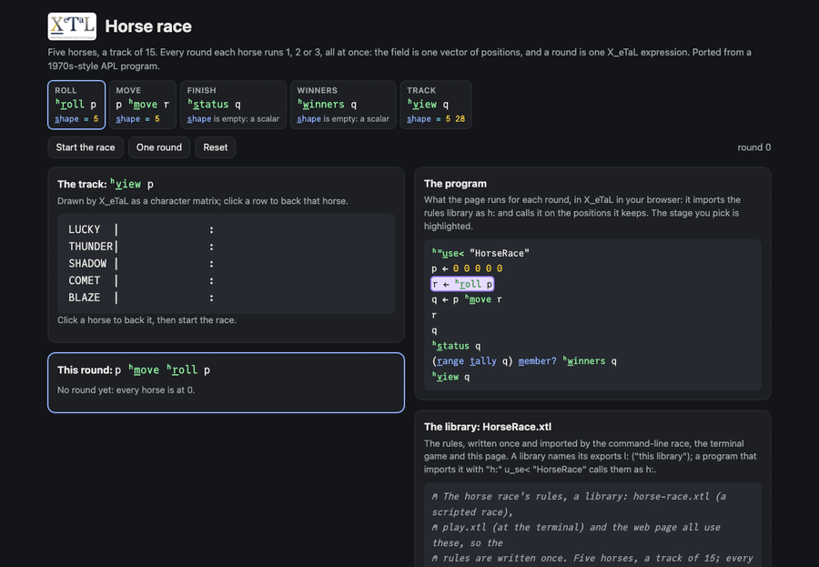

# Horse race

Five horses race to 15. Every round each horse runs 1, 2 or 3 at
random, all at once, and the first round in which any horse reaches
the finish ends the race; the horses furthest along win (a tie is
possible). In X_eTaL the whole field is one vector of positions, so a
round is one expression, `p + r_oll! 5 r_eshape 3`, whether there are
five horses or five thousand: no loop over horses anywhere.

Live: [the horse race page](https://softwarewrighter.github.io/X_eTaL-games/horse-race/)
-- back a horse, start the race, and step through each round's rolls,
moves and the finish check, highlighted in the rules.



## The program

A program imports the rules and calls them under the name it gives
the library, here `h:`. The race in `horse-race.xtl`:

```
"h:" u_se< "HorseRace"
u:r_ace := { p ->
  r := p_rint! h:r_oll p
  q := p h:m_ove r
  shown := p_rint! h:v_iew q
  1 = h:s_tatus q ? q; u:r_ace q
}
final := u:r_ace h:n_ew 5
(h:w_inners final) s_elect h:n_ames @
```

## The rules: a library

The rules are a library, `HorseRace.xtl`, used by the scripted race
(`horse-race.xtl`), the terminal game (`play.xtl`) and the web page,
so they are written once. A library names what it exports with `l:`
("this library"); each importer sees those names under its own alias
(`h:` above). A program cannot define `l:` names, and a library
cannot define `u:` ones.

```
l:finish := 15
l:n_ew := { n -> n r_eshape 0 }
l:r_oll := { p -> r_oll! (t_ally p) r_eshape 3 }
l:m_ove := { p r -> p + r }
l:s_tatus := { p -> '| r_/ p >= l:finish }
l:w_inners := { p -> w_here p = 'm_ax r_/ p }
l:v_iew := { p ->
  cols := r_ange l:finish + 5
  bar := (p m_in l:finish + 5) '>= t_able cols
  line := (0 * p) '+ t_able 1 * cols = l:finish
  (l:n_ames @) c_at_2 (f_irst "|") c_at_2 (1 + bar + 2 * line * 1 - bar) s_elect " #:"
}
```

## How it works

Read each line right to left.

- `r_oll! (t_ally p) r_eshape 3`: a vector of 3s, one per horse (shape
  5), and `r_oll!` replaces each n by a random 1 to n: every horse's
  roll at once.
- `p + r`: every horse moves by its own roll; shape 5 in, shape 5 out.
- `'| r_/ p >= l:finish`: compare every position with 15 (a 0/1
  vector), then reduce with "or": 1 when any horse is home.
- `w_here p = 'm_ax r_/ p`: the largest position (a reduce with
  `m_ax`), compared with every position, then `w_here` gives the
  numbers of the horses that equal it: one or more winners.
- `l:v_iew`: `t_able` compares every position with every column
  number (a 5 by 20 table of 0s and 1s, the bars); a second table
  marks the finish column; 1 + bar + 2 * line picks " ", "#" or ":"
  for every cell at once, and `c_at_2` joins the names, the rail and
  the bars side by side: a 5 by 28 character matrix.

## Play it

```bash
just run horse-race        # a scripted race (seed 1)
just play horse-race       # bet coins on horses at the terminal
just show horse-race       # the scripted race as a notebook
just test-game horse-race  # compare with the expected output
```

`play.xtl` starts you with 10 coins; back a horse with a digit, 1 to
5, for a coin, win 4 back if it wins, and type q to leave. Its test
plays a short session from `expected/play.in`.

## Sources

The game is a port of an APL horse race:
[sw-comp-history/apl-horse-race](https://github.com/sw-comp-history/apl-horse-race)
reconstructs a 1970s-style program (`src/race.apl`) and gives an
idiomatic APL version (`src/idiomatic-race.apl`, 394 bytes); the
COR24 APL samples carry it too. The idiomatic APL's race loop:

```
RACE;POS;_
  POS<-5 rho 0
L:POS<-POS+?5 rho 3
  SHOW
  ->L x iota ~ or/POS>=15
  'WINNER: ',(first (POS=max/POS)/iota 5) pick HORSES
```

(APL glyphs spelled out: `rho` reshape, `?` roll, `or/` and `max/`
reductions, `/` compress, `iota` index generator.) The X_eTaL lines
match it nearly one for one: `r_eshape`, `r_oll!`, `'| r_/`,
`'m_ax r_/`, and `w_here` for the compress of `iota`. The APL ends
with a branch back to `L`; X_eTaL has no branches, so a race is a
recursive function that stops when `l:s_tatus` says the race is over.
Unlike the APL, which reports the first leader, this version reports
every horse in a tie.

## Assets

None.

## Workarounds

None.
