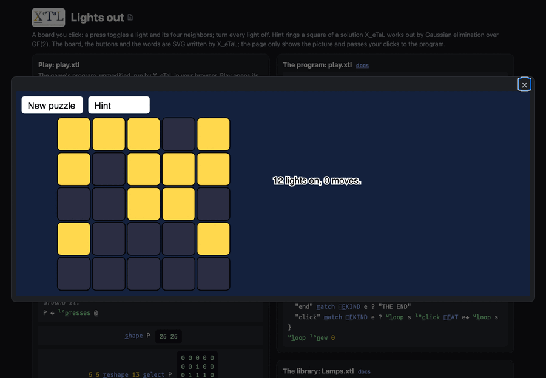

# Lights out

A 5 by 5 board of lights you click. A press toggles a light and its
four neighbors; turn every light off. New puzzle starts another, and
every puzzle can be solved (each is made by pressing squares at random
on a board all off). Hint rings a square of a solution.

Live: [the Lights out page](https://softwarewrighter.github.io/X_eTaL-games/lights-out/)
-- Play opens the board in a dialog (close it with Escape, its X or a
click outside); [this link](https://softwarewrighter.github.io/X_eTaL-games/lights-out/#play)
opens it at once. Below are the scripted game (`lights-out.xtl`) as a
notebook, and the sources.



## How it works

Read right to left. Everything is in `Lamps.xtl`.

- **A press is a row of a matrix.** `l:p_resses` is 25 by 25: row i
  has a 1 on every square at most one step from square i, made by two
  tables of distances (rows and columns), all 625 pairs at once.
- **A board of presses is one product.** `b l:a_fter p` presses the
  squares p (a 0/1 vector) on board b: `(b + p '+ '* i_nner P) m_od 2`.
  Each light flips once for every press that reaches it.
- **Solving is elimination over GF(2).** The press matrix with the board
  as its last column is reduced mod 2, a column at a time: a row with a
  1 there is swapped up and added (mod 2, an XOR) to every other row
  with a 1 there. Each pivot's press is then read from the board's
  column. The 5 by 5 matrix has rank 23: two presses are free (left
  0), and the scripted game shows the two quiet patterns that make
  four solutions of every puzzle.
- **The board is SVG text** written with [`lib/Svg.xtl`](../../lib/Svg.xtl),
  and `play.xtl` is an event loop on `[]E_VENT`, as in the map games.

From `Lamps.xtl`:

```
l:p_resses := { @ -> 0 + 1 >= (a_bs row '- t_able row) + a_bs col '- t_able col }
l:a_fter := { b p -> (b + p '+ '* i_nner l:p_resses @) m_od 2 }
```

## Play it

```bash
just show lights-out       # the scripted game as a notebook
just play lights-out       # at the terminal: lines such as click 285 215
just repl lights-out       # then "lo:" u_se< "Lamps"
just test-game lights-out  # compare with the expected output
```

## Assets

None.
