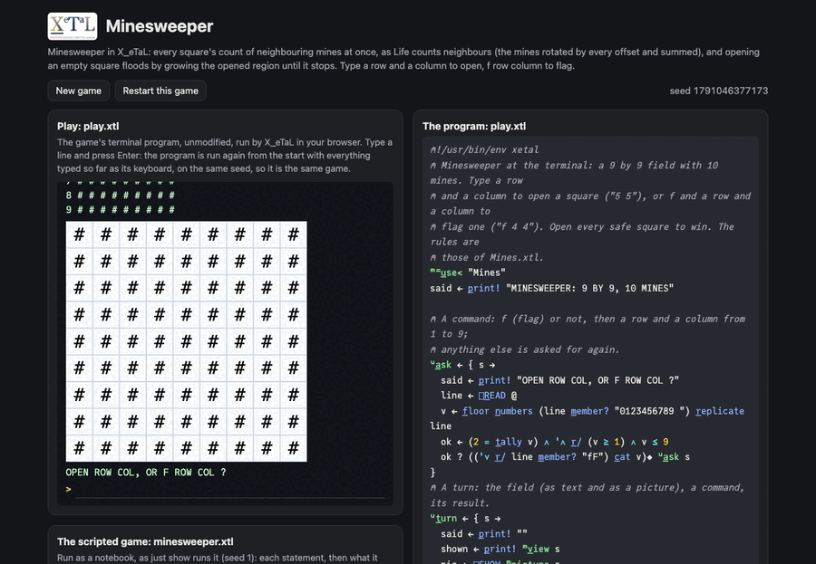

# Minesweeper

A 9 by 9 field hides 10 mines. Open a square to see how many mines
touch it, flag the squares you think are mines, and open every safe
square to win; open a mine and you lose.

Two array ideas make the whole game: every square's count of
neighboring mines is computed at once, the way Life counts
neighbors (the mine board rotated by every offset and summed), and
opening a square with no mines around floods: the opened region grows
by its neighbors, ring after ring, until it stops changing.

Live: [the minesweeper page](https://softwarewrighter.github.io/X_eTaL-games/minesweeper/)
-- the game (`play.xtl`) in a terminal, the field also drawn by X_eTaL
as a picture, the scripted game (`minesweeper.xtl`) as a notebook, and
the sources: everything on the page is X_eTaL's own output, run in
your browser.



## The program

`play.xtl` imports the rules as `m:`; each turn it shows the field
(text, and a picture with `[]S_HOW`) and opens or flags:

```
"m:" u_se< "Mines"
u:t_urn := { s ->
  shown := p_rint! m:v_iew s
  pic := []S_HOW m:p_icture s
  m:s_tatus s = 1 ? "YOU CLEARED THE FIELD!"
  m:s_tatus s = 2 ? "BOOM! YOU HIT A MINE."
  c := u:a_sk s
  1 = f_irst c ? u:t_urn s m:f_lag 1 d_rop c; u:t_urn s m:r_eveal 1 d_rop c
}
```

## The rules: a library

`Mines.xtl` (exports named `l:`, seen as `m:`). The state is the
status and three 9 by 9 0/1 boards: mines, opened, flags.

The neighbor count is the shared `Board` library's (`lib/`), the
same one the shared library offers every grid game:

```
l:a_round := { b ->
  p := 0 c_at_2 (0 c_at b c_at 0) c_at_2 0
  t := ('+ r_/_12 -1 0 1 o_-_12 p) - p
  1 d_rop_2 -1 d_rop_2 1 d_rop -1 d_rop t
}
l:g_row := { s o ->
  zero := o & 0 = l:c_ounts s
  more := (o | 0 < l:a_round zero) & n_ot l:m_ines s
  more m_atch o ? o
  s l:g_row more
}
```

## How it works

- `l:a_round`: the board inside a border of zeros (so rotation does
  not wrap around the edges); `-1 0 1 o_-_12 p` rotates it along both
  axes by every offset, nine boards at once (a 3 by 3 by 11 by 11
  array); `'+ r_/_12` sums them, less the board itself, and the
  border is dropped. Applied to the mines it gives every square's
  count.
- `l:g_row`: the opened squares with a count of 0 open their
  neighbors (`l:a_round` of those squares, above 0), never a mine;
  the step repeats until the region matches itself (`m_atch`), a fixed
  point. The scripted game prints the region's size at each step.
- `l:c_odes`: one code per square from the boards at once (unopened,
  flagged, a mine shown after a loss, or opened with its count),
  indexed into `"#F*.12345678"` for the text and the picture.
- A new field: 10 mines on the first 10 squares of a random order of
  81 (`g_rade` of random keys).

## Play it

```bash
just play minesweeper        # at the terminal
just run minesweeper         # the scripted game
just show minesweeper        # the scripted game as a notebook
just repl minesweeper        # then "m:" u_se< "Mines"
just test-game minesweeper   # compare with the expected output
```

## Assets

None.

## Workarounds

None.
