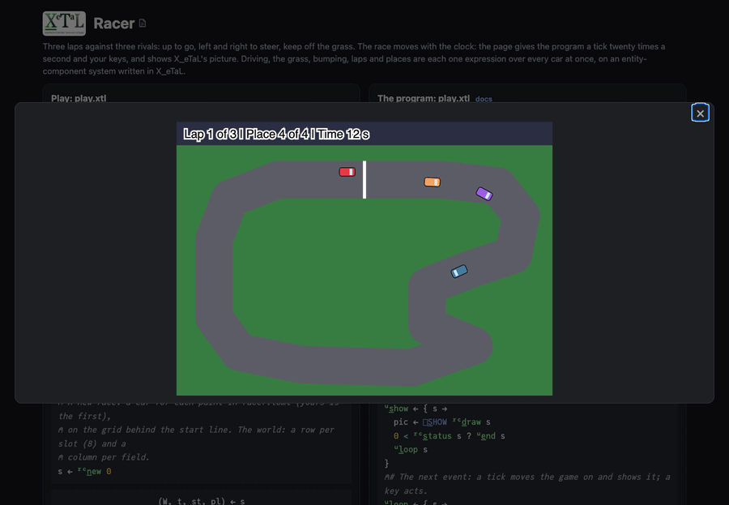

# Racer

Three laps against three rivals. Up (or `w`) speeds you up, down (or
`s`) slows you, left and right (or `a` and `d`) steer. Keep off the
grass, which slows you; bumping another car slows you both. `r` starts
again. The race moves with the clock, twenty ticks a second, and starts
two seconds after the dialog opens.

Built on [`lib/Ecs`](../../lib/README.md), an entity-component system
written in X_eTaL as arrays.

Live: [the Racer page](https://softwarewrighter.github.io/X_eTaL-games/racer/)
-- Play opens the race in a dialog (close it with Escape, its X or a
click outside) and starts the clock;
[this link](https://softwarewrighter.github.io/X_eTaL-games/racer/#play)
opens it at once. When you finish, Play or any key starts a new race.



## How it works

- **The cars are rows of one matrix.** `"h" ec:c_omponents< "pos:2 dir
  speed top next lap player paint"` (the macro in `lib/Ecs.xtlm`)
  writes the layout when the program is compiled. Your car and the
  rivals are the same kind of entity: a rival has a top speed and steers
  for the next point of the track; yours steers by your keys.
- **Every rule is a system over every car at once.** A tick (`l:t_ick`):
  the rivals steer and every car on the grass is slowed; cars that touch
  are slowed, every pair compared at once; every car moves along its
  heading; every car that comes near the point it heads for heads for
  the next, and passing the start line is a lap.
- **The grass is a table.** How far every car is from the road's middle
  line is worked out against every segment of the track at once (cars
  down, segments across), and the nearest kept; a car farther than half
  the road's width is on the grass.
- **Places are comparisons.** Each car's progress is laps, points passed
  and the way left to the next point; its place is one more than the
  number of cars ahead of it, from the table of every pair compared:
  `1 + '+ r_/_2 0 + p '< t_able p`.
- **The track and the cars are data.** `racer.toml` holds the track's
  middle line as points, the road's width, each car's paint and top
  speed, and the race's numbers. `test.sh` adds a fifth rival there and
  checks it races by the same systems.
- **The state is a tuple:** `(world, seconds, finished, place)`.
- The clock's ticks and your keys come to `play.xtl` as `[]E_VENT`
  events (`tick 0.05`, `key UP`), on the page as at the command line.

## Play it

```bash
just show racer       # the scripted race as a notebook
just play racer       # at the terminal: lines such as tick 0.05 and key UP
just test-game racer  # compare with the expected output
```

At the terminal nothing moves until you type a `tick` line; the page
gives the ticks. The expected race (`expected/play.in`) is driven by a
simple rule, one key a tick: steer toward the next point of the track
when it is off to a side, else speed up. It wins.

## Assets

None.
