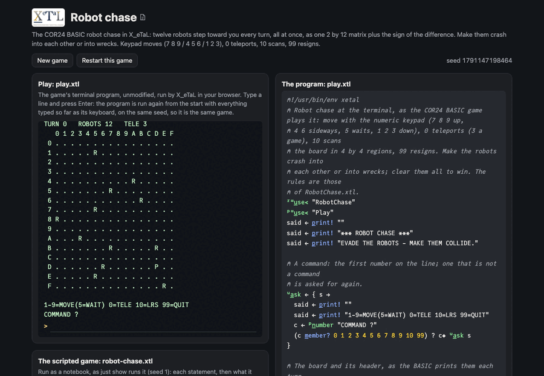

# Robot chase

Twelve robots chase you across a 16 by 16 board. Each turn you step
(or wait, or teleport), then every robot steps one square toward you.
Robots that land on the same square crash and leave a wreck; a robot
that walks into a wreck is destroyed. Clear the board to win; meet a
robot or a wreck and you lose. It is a port of the COR24 BASIC robot
chase, and the reason it is here: in the BASIC every robot moves in a
`FOR` loop, one at a time; in X_eTaL the robots are one matrix, and
all of them move in one expression, as the game says they do.

Live: [the robot chase page](https://softwarewrighter.github.io/X_eTaL-games/robot-chase/)
-- the game (`play.xtl`) in a terminal, the scripted game
(`robot-chase.xtl`) as a notebook, and the sources: everything on the
page is X_eTaL's own output, run in your browser.



## The program

`play.xtl` imports the rules as `r:` and loops: show the board, read a
command, `s r:m_ove c`, say what happened.

```
"r:" u_se< "RobotChase"
u:t_urn := { s ->
  shown := p_rint! u:s_how s
  c := u:a_sk s
  c = 10 ? u:t_urn u:s_can s
  t := s r:m_ove c
  0 = r:e_vent t ? u:a_fter t; u:a_fter u:s_ay t
}
```

## The rules: a library

`RobotChase.xtl` (exports named `l:`, seen as `r:`). The whole game
is one flat vector: your row and column, teleports, turn, the last
event, the status, the robots' rows, columns and which are alive, and
the 256 squares of wreckage. The robots' turn:

```
l:o_nSquares := { k w -> ((r_ange 256) '= t_able k) '+ '* i_nner w }
l:c_hase := { s ->
  a := l:a_live s
  w := r_avel l:w_recks s
  d := ((l:p_os s) 'l_eft t_able r_ange l:n) - l:r_obots s
  R := (l:r_obots s) + ((2 c_at l:n) r_eshape a) * d [> - <] 0
  k := l:c_ell R
  caught := '| r_/ a * k = l:c_ell l:p_os s
  a1 := a * n_ot k s_elect w
  crash := a1 * 1 < k s_elect k l:o_nSquares a1
  ...
}
```

Squares, spacing and neighbors come from the shared `Board` library
(`lib/`), input from `Play`.

## How it works

Read each line right to left.

- `P := (l:p_os s) 'l_eft t_able r_ange l:n`: your position repeated
  into a 2 by 12 matrix, one column per robot, to line up with the
  robots' matrix `R` (row 1 their rows, row 2 their columns).
- `d [> - <] 0`: a dyadic fork, `(d > 0) - (d < 0)`: the sign of
  every difference, -1, 0 or 1, for every robot and both coordinates
  at once. Adding it (masked by which robots are alive) moves every
  robot one step toward you, in one expression.
- `k := l:c_ell R`: every robot's square number, 1 to 256.
- `l:o_nSquares`: a 256 by 12 table of square against robot, times a
  vector with one number per robot (an inner product): how much lands
  on each square. With the live robots it counts the robots on every
  square, so a robot whose square counts more than 1 has crashed (the
  BASIC compares every pair in a nested `FOR I`, `FOR J`); with the
  crashed robots it gives the new wrecks, or-ed into the wreckage.
- The board you see: `l:c_odes` combines three 0/1 boards (robots,
  wrecks, you) into one code per square, indexed into `".R*PX"` for
  the text (spaced by `Board`'s `l:s_paced`) and for the picture.
- The long-range scan: the 256 squares reshaped to a 4 by 4 by 4 by 4
  array (region row, row, region column, column) and summed over axes
  2 and 4 (`'+ r_/_24`): the robots, wrecks and you in each region.
- A new game: 13 different random squares are the first 13 of the
  order (`g_rade`) of 256 random keys.

The board is also a picture X_eTaL draws (`l:p_icture`, `[]G_RID` of
the 16 by 16 character board), shown with `[]S_HOW` each turn: in the
page's terminal, or as files in `work/draw/robot-chase/`.

## Play it

```bash
just play robot-chase        # at the terminal
just run robot-chase         # the scripted game: one step shown, a crash, a loss
just show robot-chase        # the scripted game as a notebook
just repl robot-chase        # then "r:" u_se< "RobotChase" and r:v_iew r:n_ew 0
just test-game robot-chase   # compare with the expected output
```

Commands, as in the BASIC: 7 8 9 move up-left, up, up-right; 4 and 6
sideways; 5 waits; 1 2 3 down; 0 teleports (three a game); 10 scans;
99 resigns.

## Assets

None.

## Workarounds

None.
