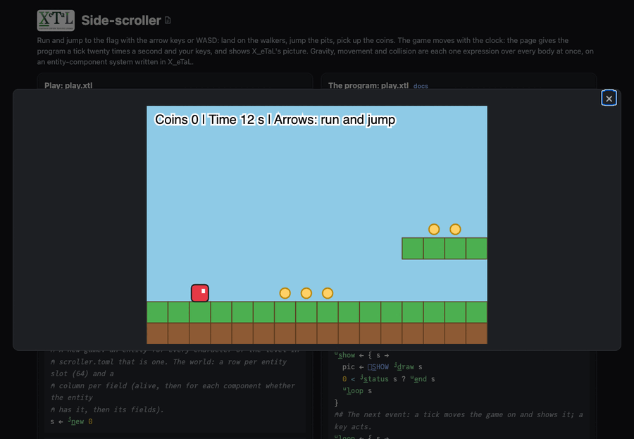

# Side-scroller

Run right to the flag. Left and right (or `a` and `d`) run, up (or `w`)
jumps. Land on a walker to beat it; touch one any other way and you are
caught. Jump the pits, and pick up the coins on the way. `r` starts
again. The game moves with the clock, twenty ticks a second.

The second game built on [`lib/Ecs`](../../lib/README.md), an
entity-component system written in X_eTaL as arrays, and the first one
moved by the clock.

Live: [the Side-scroller page](https://softwarewrighter.github.io/X_eTaL-games/scroller/)
-- Play opens the game in a dialog (close it with Escape, its X or a
click outside) and starts the clock;
[this link](https://softwarewrighter.github.io/X_eTaL-games/scroller/#play)
opens it at once. A game won or lost ends; Play or any key then starts
a new one.



## How it works

- **The world is a matrix.** A row per entity (you, each walker, each
  coin, the flag), a column per field. `"h" ec:c_omponents< "pos:2
  vel:2 body walker coin player goal"` (the macro in `lib/Ecs.xtlm`)
  writes the layout when the program is compiled.
- **The level is data.** `scroller.toml` holds the level as rows of
  characters and the physics as numbers. Every entity comes from a
  character in the level, so a longer level, more walkers or more coins
  are edits there, not code.
- **Every rule is a system over every body at once.** A tick
  (`l:t_ick`): gravity speeds up every body's fall; every body moves
  across by its speed and is stopped by the ground in its way (a walker
  turns back); every body moves down (or up) and lands on the ground or
  hits it overhead; then what touches you: coins are picked up, a walker
  you land on is beaten, the flag wins. You and the walkers are the same
  kind of body, so the walkers fall into pits by the same rule as you.
  `test.sh` drops a walker from the sky in a copy of the level and checks
  that it lands on the ground like the others.
- **Masks are numbers.** Collision is arithmetic on whole columns: the
  tiles at every body's leading edge are looked up at once, and the
  positions of the bodies that hit one are snapped against it with
  `nx * (1 - hit) + snap * hit`, no branch per body.
- **The state is a tuple:** `(world, coins, seconds, standing)`.
- The clock's ticks and your keys come to `play.xtl` as `[]E_VENT`
  events (`tick 0.05`, `key UP`), on the page as at the command line.
  The program draws the whole picture each tick: the level is drawn
  once, and each picture slides it under a view 16 tiles wide.

From `Jump.xtl`, every body moving across at once:

```
hit := (vx != 0.0) & (h:s_olid (f_loor y + 0.01, c)) | h:s_olid (f_loor y + SIZE - 0.01, c)
h := f_loat hit
snap := (f_loat c) + (f_loat n_ot ahead) - SIZE * f_loat ahead
nx := (nx * 1.0 - h) + snap * h
```

## Play it

```bash
just show scroller       # the scripted game as a notebook
just play scroller       # at the terminal: lines such as tick 0.05 and key UP
just test-game scroller  # compare with the expected output
```

At the terminal nothing moves until you type a `tick` line; the page
gives the ticks.

## Changing the level

`scroller.toml` holds the level (rows of equal length: `#` ground, `.`
sky, `@` you, `o` a coin, `w` a walker, `F` the flag; past the bottom is
a pit) and the physics (gravity, a jump's speed, running speed, a
walker's speed, the fastest fall, the speed kept each tick).

## Assets

None.
