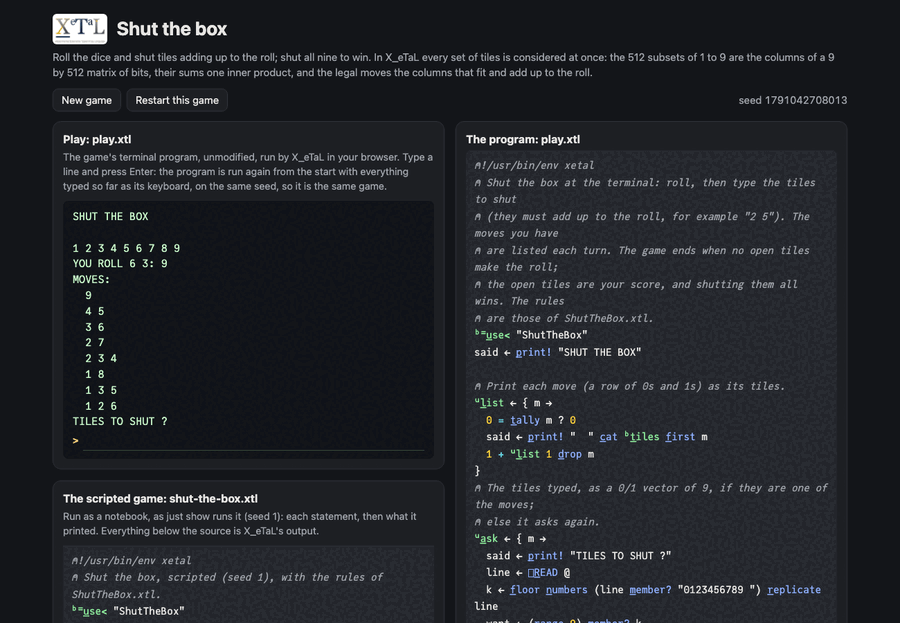

# Shut the box

The pub dice game: tiles 1 to 9 start open. Each turn roll two dice
(one die once the open tiles add up to 6 or less) and shut open tiles
adding up to the roll. When no set of open tiles makes the roll, the
game is over and the open tiles are your score; shut them all to win.

In X_eTaL the question "which sets of open tiles add up to the roll?"
is asked of every set at once: the 512 subsets of 1 to 9 are the
columns of a 9 by 512 matrix of bits, all their sums are one inner
product, and the moves are the columns that fit the open tiles and
make the roll.

Live: [the shut the box page](https://softwarewrighter.github.io/X_eTaL-games/shut-the-box/)
-- the game (`play.xtl`) in a terminal, the scripted game
(`shut-the-box.xtl`) as a notebook, and the sources: everything on the
page is X_eTaL's own output, run in your browser.



## The program

`play.xtl` imports the rules as `b:`; each turn it rolls, lists the
moves and asks for the tiles to shut:

```
"b:" u_se< "ShutTheBox"
u:t_urn := { s ->
  said := p_rint! b:v_iew s
  d := b:r_oll s
  m := s b:m_oves '+ r_/ d
  0 = t_ally m ? "NO MOVE. YOUR SCORE: " c_at f_ormat b:s_core s
  ...
  t := s b:s_hut u:a_sk m
  0 = b:s_core t ? "YOU SHUT THE BOX!"
  u:t_urn t
}
```

## The rules: a library

`ShutTheBox.xtl` (exports named `l:`, seen as `b:`). The state is the
open tiles, a 0/1 vector of 9.

```
l:s_ubsets := { @ -> 2 2 2 2 2 2 2 2 2 e_ncode o_ffsets 512 }
l:s_ums := { @ -> (r_ange 9) '+ '* i_nner l:s_ubsets @ }
l:m_oves := { s r ->
  M := l:s_ubsets @
  fits := '& r_/ M <= s 'l_eft t_able o_ffsets 512
  o_\ (w_here fits & r = l:s_ums @) s_elect_2 M
}
```

## How it works

- `2 2 2 2 2 2 2 2 2 e_ncode o_ffsets 512`: the binary digits of 0 to
  511, one column each: every subset of the nine tiles, tile 1 in the
  top row.
- `(r_ange 9) '+ '* i_nner M`: the tiles 1 to 9 times each column,
  summed: all 512 subset sums in one expression.
- `fits`: the open tiles spread across 512 columns by a table; a
  subset fits when every bit is at most the tile's 0 or 1 (`<=`),
  reduced with "and" down each column.
- The moves: `w_here` the columns that fit and make the roll, picked
  with `s_elect_2` and turned to one move per row with transpose
  (`o_\`).
- The high-tiles player (`l:h_igh`) reads each move as a binary number
  with tile 9 worth most and takes the largest; in the scripted game it
  shuts the box.

## Play it

```bash
just play shut-the-box        # at the terminal
just run shut-the-box         # the scripted game
just show shut-the-box        # the scripted game as a notebook
just repl shut-the-box        # then "b:" u_se< "ShutTheBox"
just test-game shut-the-box   # compare with the expected output
```

## Assets

None.

## Workarounds

None.
