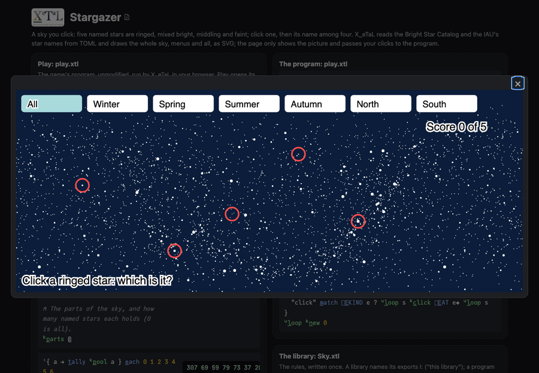

# Stargazer

A sky you click. Each round rings five named stars, mixed: one bright
and famous, two middling, two faint. Click a ringed star: a menu of
four star names opens beside it, the right one and one star from each
brightness band (from anywhere in the sky, so the choices are never all
obscure). Click a name: the ring turns green (right) or orange (wrong)
and the star is labeled, and the score goes up when you are right. The
buttons along the top start a round in a part of the sky (the winter,
spring, summer and autumn evening skies of the north, the north and
south polar skies), zoomed to it, or in all of it.

After [wrightmikea/stargazer-poc](https://github.com/wrightmikea/stargazer-poc),
written again in X_eTaL as the capitals map is.

Live: [the Stargazer page](https://softwarewrighter.github.io/X_eTaL-games/stargazer/)
-- Play opens the sky in a large dialog (close it with Escape, its X or
a click outside); [this link](https://softwarewrighter.github.io/X_eTaL-games/stargazer/#play)
opens it at once. Below the dialog are the scripted game
(`stargazer.xtl`) as a notebook, and the sources.



## How it works

Everything in the sky is written by X_eTaL, in `Sky.xtl`, with the
pieces in [`lib/Svg.xtl`](../../lib/Svg.xtl) that the capitals map uses
too; the page shows the picture and passes your clicks to the program.

- **The data is TOML.** `[]T_ABLE` reads the named stars (name, right
  ascension, declination, magnitude, constellation) and the parts of
  the sky; `[]L_IST` the catalog's stars behind and the brightness
  bands. Your own stars in `stars.toml` are joined with `c_at`.
- **Brightness bands as a table.** Each star's band is one plus how
  many band edges its magnitude is above: `mag '> t_able edges`, summed
  along each row, for every star at once.
- **The sky.** Right ascension grows to the left, as the sky looks from
  the ground: sky units are hundredths of a degree, x = 100 (360 - ra),
  y = 100 (90 - dec). The catalog's 2887 stars to magnitude 5.5 are
  drawn once, as five paths of points (one per brightness class) whose
  dots keep their size on the screen at every zoom; the sky is drawn
  three times a turn apart, so a part of the sky across 0h (autumn) is
  whole.
- **A round.** The part's named stars in a random order, then
  `mix` of each band taken in turn (one bright, two middling, two faint,
  from `stars.toml`).
- **The choices.** For each band, a star of that band other than the
  one asked, picked by the round's random number: the same round always
  has the same choices, so a game replays exactly. They are ordered by
  right ascension.
- **The clicks.** `play.xtl` is an event loop on `[]E_VENT`, as the
  capitals map's is.

From `Sky.xtl`:

```
band := 1 + '+ r_/_2 0 + mag '> t_able -1 d_rop edges
l:c_hoices := { q i ->
  c := i c_at '{ b -> q o_ne i c_at b } e_ach r_ange t_ally mix
  (g_rade c s_elect n_eg ra) s_elect c
}
```

## Play it

```bash
just show stargazer       # the scripted game as a notebook (a round played by clicks)
just play stargazer       # at the terminal: type lines such as click 25871 10671 (sky units)
just repl stargazer       # then "k:" u_se< "Sky"
just test-game stargazer  # compare with the expected output
```

## Changing the game

`stars.toml` holds the parts of the sky (their right ascension and
declination bounds), the brightness bands and the round's mix, and
stars of your own: list each key in `stars` and give it a table with
its name, right ascension and declination (degrees), magnitude and
constellation. The file's comment shows an example, and `test.sh`
checks that an added star joins the game.

## Assets

`assets/fetch.sh` downloads the Yale Bright Star Catalog, 5th revised
edition (Hoffleit and Warren; NASA, public domain; from CDS, catalog
V/50) and the IAU Catalog of Star Names (the IAU Working Group on Star
Names; IAU products are Creative Commons Attribution: source, the IAU),
both checked by SHA-256, into the git-ignored `assets/cache/`;
`assets/convert.py` writes `assets/cache/sky.toml`: every catalog star
to magnitude 5.5 and the named stars to magnitude 5. Nothing is placed
or drawn there.

## Known limits

- The polar parts of the sky are drawn in the same plate carree as the
  rest, so they stretch near the poles.
- Each click runs the program again from the start (as every page here
  replays its input); X_eTaL's terminal pane and resumable runs will
  end that.
