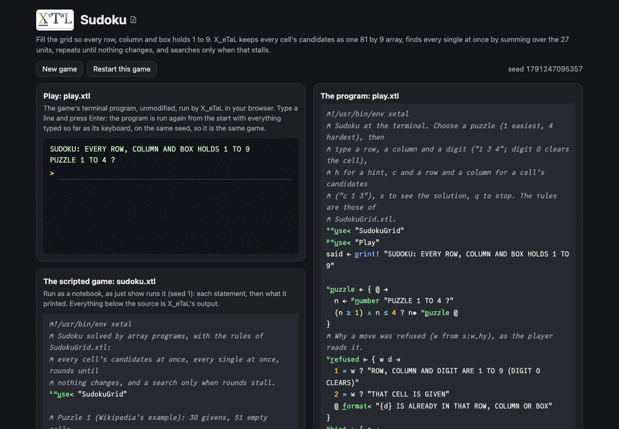

# Sudoku

Fill the 9 by 9 grid so that every row, every column and every 3 by 3
box holds the digits 1 to 9. The program keeps every cell's candidates
as one 81 by 9 array of 0s and 1s, finds every single at once by
summing over the 27 units, repeats until nothing changes, and searches
only when that stalls. It solves Arto Inkala's "hardest" puzzle in
under a second.

Live: [the Sudoku page](https://softwarewrighter.github.io/X_eTaL-games/sudoku/)
-- the game (`play.xtl`) in a terminal, the scripted solver
(`sudoku.xtl`) as a notebook, and the sources: everything on the page
is X_eTaL's own output, run in your browser.



## The program

`sudoku.xtl` takes four puzzles, easiest first, from candidates to
search. The center of it, in `SudokuGrid.xtl`:

```
l:p_erUnit := { m -> '+ r_/_2 (l:u_nits @) s_elect m }
l:c_andidates := { g ->
  f := l:o_nehot g
  open := (g = 0) '* t_able 9 r_eshape 1
  0 + (0 < f) | (0 < open) & 0 = l:p_erCell l:p_erUnit f
}
```

## How it works

Read right to left.

- A grid is 81 digits, row by row, 0 for an empty cell. `l:o_nehot`
  turns it into an 81 by 9 array: a 1 at each filled cell's digit
  (`g '= t_able r_ange 9`).
- `l:u_nits @` is a 27 by 9 table of cell numbers: the 9 rows, the 9
  columns and the 9 boxes. Selecting with the table,
  `(l:u_nits @) s_elect m`, gives a 27 by 9 by 9 array (unit, cell,
  digit), and `'+ r_/_2` sums out the cells: how many times each digit
  appears in each unit, for all 27 units at once.
- `l:p_erCell` goes back: each cell adds up the rows of its three
  units (its row's, its column's, its box's, from `l:h_omes @`). A
  digit is a candidate in an empty cell where that sum is 0.
- `l:s_ingles` finds every single at once. A naked single is a cell
  with one candidate left (`1 = '+ r_/_2 c`). A hidden single is a
  digit with one place left in a unit (`1 = l:p_erUnit c`, taken back
  to the cells).
- `l:r_ound` fills every single at once. `l:p_ropagate` repeats it
  until the grid stops changing. A cell given two digits in one round
  means the grid has no solution.
- `l:s_olve` propagates, then guesses in the cell with the fewest
  candidates (the first of `g_rade` of the counts), each candidate in
  turn, and propagates again after each guess. It backs up when a guess
  leads to a contradiction.

Selecting with a table is how the units are counted. A product with
the 27 by 81 membership matrix (`i_nner`) gives the same counts, but
it was 20 times slower here.

## Play it

At the terminal, choose a puzzle (1 easiest, 4 hardest), or type or
paste one of your own: 81 cells, row by row, a digit or 0 or `.` for
an empty cell (other characters are left out, so a pasted grid with
spaces or line breaks works). It is checked first: refused, with the
reason, when it is not 81 cells, has a digit twice in a row, column or
box, or has no solution. Then type a
row, a column and a digit (`1 3 4`; digit 0 clears the cell). `h`
gives a hint (the first single, else a digit from the solution), `c 1
3` lists a cell's candidates, `s` shows the solution, and `q` stops. A
move is refused when the cell is a given or the digit is already in
the cell's row, column or box.

```bash
just play sudoku         # at the terminal
just run sudoku          # the scripted solver
just show sudoku         # as a notebook: each statement, then its output
just repl sudoku         # then "s:" u_se< "SudokuGrid"
just test-game sudoku    # compare with the expected output
```

## Adding puzzles

The built-in puzzles are in `puzzles.toml`, one string of 81 cells each
(read with X_eTaL's `[]L_IST`), easiest first: add a puzzle by adding a
string and its name.

## Sources

The rules are the standard ones. The puzzles are Wikipedia's example,
a 17-given puzzle (the fewest a sudoku with one solution can have),
Peter Norvig's first hard one, and Arto Inkala's (2012).

## Assets

None.

## Workarounds

The unit counts select with a table instead of an inner product with
the membership matrix, which X_eTaL computes slowly (an ask in
[`docs/xetal-asks.md`](../../docs/xetal-asks.md)).
