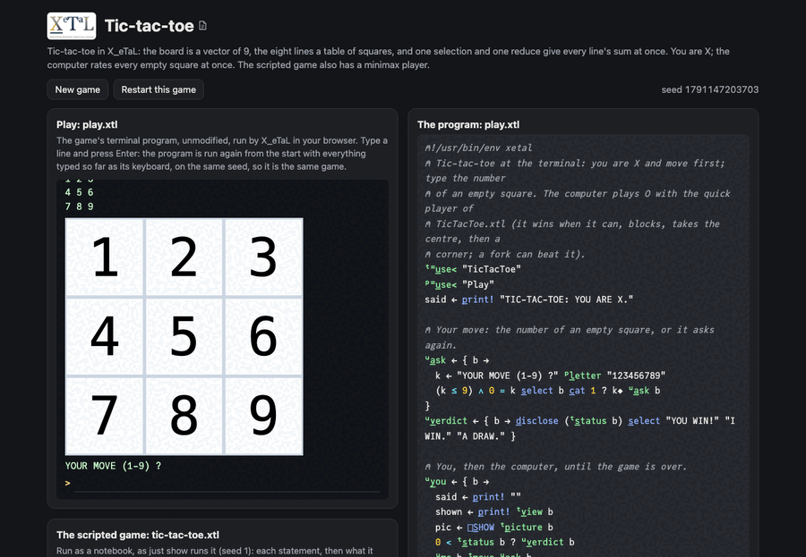

# Tic-tac-toe

Three in a row on a 3 by 3 board. In X_eTaL the board is a vector of
9 squares (0 empty, 1 X, -1 O) and the eight lines are an 8 by 3
table of square numbers: used as indices into the board, the table
gives every line's squares at once, and one reduce gives every line's
sum, so a win is a 3 or a -3 among eight numbers.

Live: [the tic-tac-toe page](https://softwarewrighter.github.io/X_eTaL-games/tic-tac-toe/)
-- the game (`play.xtl`) in a terminal, the scripted game
(`tic-tac-toe.xtl`) as a notebook, and the sources: everything on the
page is X_eTaL's own output, run in your browser.



## The program

`play.xtl` imports the rules as `t:`; you are X and type a square, the
computer replies with `t:a_i`:

```
"t:" u_se< "TicTacToe"
u:y_ou := { b ->
  shown := p_rint! t:v_iew b
  0 < t:s_tatus b ? u:v_erdict b
  u:m_e b t:m_ove u:a_sk b
}
```

## The rules: a library

`TicTacToe.xtl` (exports named `l:`, seen as `t:`):

```
l:l_ines := { @ -> 8 3 r_eshape 1 2 3 4 5 6 7 8 9 1 4 7 2 5 8 3 6 9 1 5 9 3 5 7 }
l:s_ums := { b -> '+ r_/_2 (l:l_ines @) s_elect b }
l:t_urn := { b -> 1 - 2 * 0 != '+ r_/ b }
l:m_ove := { b k -> b + (l:t_urn b) * k = r_ange 9 }
l:a_i := { b ->
  p := l:t_urn b
  f := (b l:n_ear 2 * p) c_at (b l:n_ear -2 * p) c_at (5 = r_ange 9) c_at (r_ange 9) m_ember? 1 3 7 9
  r := (b = 0) * 1 + 1000 100 10 5 '+ '* i_nner 4 9 r_eshape f
  f_irst w_here r = 'm_ax r_/ r
}
l:v_alue := { b ->
  w := l:w_inner b
  w != 0 ? w
  e := l:l_egal b
  0 = t_ally e ? 0
  p := l:t_urn b
  p * 'm_ax r_/ p * '{ l:v_alue b l:m_ove _r } e_ach e
}
```

## How it works

- `(l:l_ines @) s_elect b`: an 8 by 3 matrix of indices picks an 8 by
  3 matrix of squares; `'+ r_/_2` sums each line.
- A move: `k = r_ange 9` is a 0/1 vector with a 1 at square k, times
  the mover (1 or -1), added to the board.
- The quick player, `l:a_i`: a 9 by 8 table says which squares lie on
  which lines (`l:o_n`, from a 9 by 8 by 3 table of every square
  against every entry). A line whose sum is 2 (or -2) has two marks
  and one empty square; or-ing that over the lines through each
  square says, for all nine squares at once, where a move wins or
  blocks. With the centre and the corners that makes four features
  per square, a 4 by 9 matrix; one inner product with the weights
  1000, 100, 10 and 5 rates all nine squares, and the best empty
  square is played.
- The perfect player, `l:v_alue` and `l:b_est`: minimax by recursion,
  every legal move's value with `e_ach`, written as negamax (the mover
  times the largest of the mover times each value, so one formula
  serves both players). From an empty board it finds
  the draw, but searches half a million positions (about 17 seconds
  natively), so the terminal game uses the quick player and the
  scripted game shows minimax on a position with five empty squares.

The board is also shown as a picture X_eTaL draws: `l:p_icture` is
`[]G_RID` of the 3 by 3 character board, and `play.xtl` shows it with
`[]S_HOW` each turn (the page draws it in the terminal; the command
line writes it to `work/draw/tic-tac-toe/`).

## Play it

```bash
just play tic-tac-toe        # at the terminal, you are X
just run tic-tac-toe         # the scripted game
just show tic-tac-toe        # the scripted game as a notebook
just repl tic-tac-toe        # then "t:" u_se< "TicTacToe"
just test-game tic-tac-toe   # compare with the expected output
```

## Assets

None.

## Workarounds

None.
