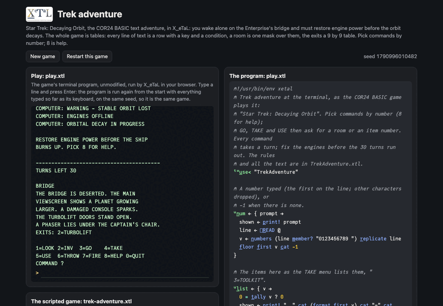

# Trek adventure

"Star Trek: Decaying Orbit", a small text adventure: you wake alone on
the Enterprise's bridge, the ship's orbit decaying. Find the toolkit
and the engine coupler, prep the relay in engineering and install the
coupler before 30 turns run out, past a locked armory and Klingon
boarders (a tribble helps). Commands are numbers, as in the COR24
BASIC game it ports: 1 look, 2 inventory, 3 go, 4 take, 5 use, 6
throw, 7 fire, 8 help, 0 quit.

What makes it an X_eTaL game: there is no branching code for the
story. Every line the game can print is a row of one table, with a key
(a room, an event, an ending) and a condition on the game's state; a
room's description is the rows whose key it is and whose condition
holds, picked by one mask. The exits are a 9 by 9 table of 0s and 1s,
the items' places a vector, and a turn is an update of the state
vector.

Live: [the trek adventure page](https://softwarewrighter.github.io/X_eTaL-games/trek-adventure/)
-- the game (`play.xtl`) in a terminal, the scripted walkthrough
(`trek-adventure.xtl`) as a notebook, and the sources: everything on
the page is X_eTaL's own output, run in your browser.



## The program

`play.xtl` imports the rules as `t:` and loops: describe the room,
read a command (and a room or item number), say what happened, run
the clock.

```
"t:" u_se< "TrekAdventure"
u:t_urn := { s ->
  0 < t:s_tatus s ? s t:s_ay 200 + t:s_tatus s
  ...
  said := s t:s_ay t:r_oom s
  c := u:n_um "COMMAND ?"
  c = 0 ? s t:s_ay 204
  next := s t:m_ove c c_at s u:a_rg c
  said := next t:s_ay t:s_aid next
  later := t:c_lock next
  said := later t:s_ay t:a_larms later
  u:t_urn later
}
```

## The rules: a library

`TrekAdventure.xtl` (exports named `l:`, seen as `t:`). The text is a
table of 157 lines in four columns: `l:t_ext` (the lines), `l:k_eys`,
`l:f_lags` and `l:v_alues` (show the line only when state item f has
value v). Printing is one mask:

```
l:l_ines := { s k ->
  f := l:f_lags @
  held := (1 + f) s_elect -1 c_at s
  w_here ((l:k_eys @) m_ember? k) & (f = 0) | held = l:v_alues @
}
```

The state is one vector of 12: room, turns left, the five items
carried, relay prepped, boarders aboard, won, dead, and the last
event (the key of what to say). A command returns the new state;
several items change at once by a table:

```
l:u_pdate := { s iv ->
  k := (t_ally iv) d_iv 2
  m := (r_ange t_ally s) '= t_able ((2 * r_ange k) - 1) s_elect iv
  v := ((t_ally s) c_at k) r_eshape (2 * r_ange k) s_elect iv
  (s * n_ot '| r_/_2 m) + '+ r_/_2 m * v
}
```

## How it works

- `l:l_ines`: `m_ember?` marks the rows with any of the keys asked for
  (a room, an event, or several clock messages at once); each row's
  condition item is looked up in the state with one `s_elect` (item 0,
  "always", reads a -1 that matches no value); `&` and `|` combine the
  two 0/1 vectors and `w_here` turns the mask into row numbers.
  Storage loses its "toolkit" and "coupler" rows the moment those
  items are carried, with no code for it.
- `l:g_o`: a move is allowed when row `room`, column `x` of the exits
  table is 1 (`x s_elect r s_elect l:e_xits @`); the armory also wants
  the ID card.
- `l:u_pdate`: a table of every state position against every index
  being changed, reduced with "or" along the rows to say which items
  change, and the values spread across the same table and summed: an
  update of several items in one expression, no loop and no mutation.
- The scripted game plays the winning walkthrough from a table of
  commands and keeps every state: the whole game becomes a 12 by 12
  table, a row per turn and a column per state item, where you can
  read the toolkit being taken, the boarders arriving at turn 21 and
  the win.

## Play it

```bash
just play trek-adventure        # at the terminal
just run trek-adventure         # the scripted walkthrough
just show trek-adventure        # the walkthrough as a notebook
just repl trek-adventure        # then "t:" u_se< "TrekAdventure"
just test-game trek-adventure   # compare with the expected output
```

## Assets

None.

## Workarounds

None.
