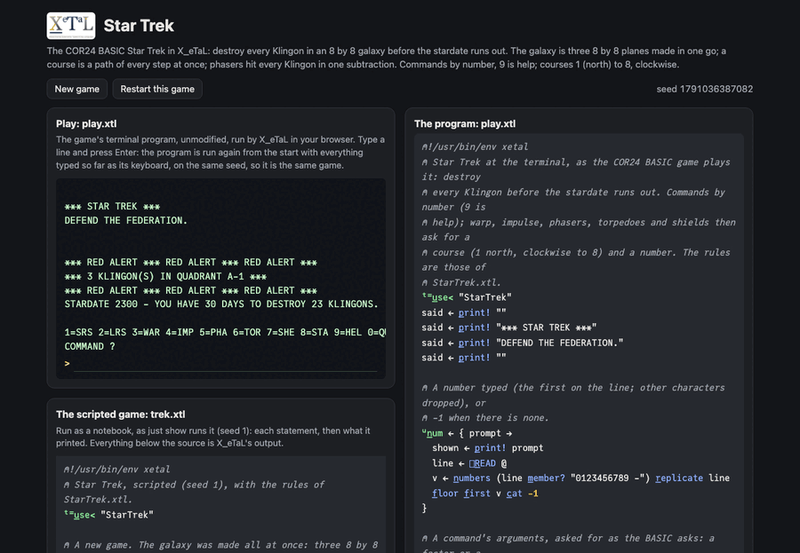

# Star Trek

The classic text-mode Star Trek, as the COR24 BASIC demo plays it: an
8 by 8 galaxy of quadrants, each an 8 by 8 grid of sectors. Find and
destroy every Klingon before the stardate runs out, with warp drive
(between quadrants), impulse (within one), phasers, photon torpedoes
and shields; Klingons in your quadrant fire back.

In X_eTaL the galaxy is three 8 by 8 planes (Klingons, bases, stars)
made at once from random arrays; a course is a 2 by k matrix of every
step at once, and the first thing in the way is found with `w_here`;
phasers hit every Klingon in the quadrant in one subtraction; the
long-range scan is a 5 by 5 window cut from the planes by indexing.

Live: [the Star Trek page](https://softwarewrighter.github.io/X_eTaL-games/trek/)
-- the game (`play.xtl`) in a terminal, the scripted game (`trek.xtl`)
as a notebook, and the sources: everything on the page is X_eTaL's own
output, run in your browser.



## The program

`play.xtl` imports the rules as `t:` and loops: the menu, a command
and its numbers, `s t:c_ommand c c_at args`.

```
"t:" u_se< "StarTrek"
u:t_urn := { s ->
  0 < t:s_tatus s ? p_rint! t:e_nd s
  said := p_rint! "1=SRS 2=LRS 3=WAR 4=IMP 5=PHA 6=TOR 7=SHE 8=STA 9=HEL 0=QUI"
  c := u:n_um "COMMAND ?"
  u:t_urn s t:c_ommand c c_at s u:a_rgs c
}
```

## The rules: a library

`StarTrek.xtl` (exports named `l:`, seen as `t:`). The game is one
vector: energy, torpedoes, shields, stardate, deadline, quadrant,
sector, status, then the three galaxy planes and the current
quadrant's 64 sectors (0 empty, 1 the Enterprise, 2 a star, 3 a base,
4 and more a Klingon, its hit points plus 4).

```
l:n_ew := { x ->
  kl := (85 < r_oll! 64 r_eshape 100) * r_oll! 64 r_eshape 3
  0 = '+ r_/ kl ? l:n_ew x
  bases := 2 >= r_oll! 64 r_eshape 10
  stars := r_oll! 64 r_eshape 5
  ...
}
l:p_ath := { s ck ->
  d := (f_irst ck) s_elect_2 l:c_ourses @
  k := r_ange 2 s_elect ck
  ((l:s_ector s) 'l_eft t_able k) + d '* t_able k
}
```

Shared pieces come from `lib/`: `Board` (sector numbers, the spaced
short-range scan), `State` (updates of several items at once, a
stretch replaced), `Text` (lines printed), `Play` (numbers typed). The
state's positions are named (`l:energy`, `l:shieldsAt`, `l:quadRow`,
...), so an update reads as what it changes.

## How it works

- A new galaxy: 64 random numbers decide which quadrants hold
  Klingons, 64 more how many, 64 the bases, 64 the stars: four
  expressions instead of a nested loop.
- Entering a quadrant: the codes of everything in it (the Enterprise,
  Klingons, base, stars, then empty sectors) in a row, put into the
  sectors of a random order of 64 (`g_rade` of random keys); the
  order's own `g_rade` is its inverse, which does the putting.
- A course: the compass is a 2 by 8 table of steps; `t_able` turns a
  course and a length into the whole path, a 2 by k matrix. Impulse
  and torpedoes look up every step's sector at once and take the first
  step that leaves the quadrant or meets something (`w_here`).
- Phasers: every sector's code less the energy's share where there is
  a Klingon (`g - hit * p d_iv n`); a Klingon below 4 is destroyed;
  one line per Klingon is printed from the hit sectors and what is
  left of them.
- The long-range scan: a 5 by 5 table of window positions (clamped,
  with a mask for those off the galaxy); one `s_elect` along axis 2
  takes the three planes' values for all 25 quadrants from a 3 by 64
  matrix, and each quadrant's four characters are picked at once from
  `" *0123456789"`, read column by column (`r_avel_2`).
- The short-range scan: the 64 codes cut to 4 and read as `.E*BK`,
  every other column a space (`2 r_eplicate_2`).
- One change from the BASIC: a destroyed Klingon is also taken off the
  galaxy, so Klingons do not come back when you leave and return.

## Play it

```bash
just play trek        # at the terminal
just run trek         # the scripted game
just show trek        # the scripted game as a notebook
just repl trek        # then "t:" u_se< "StarTrek"
just test-game trek   # compare with the expected output
```

Commands: 1 short-range scan, 2 long-range scan, 3 warp (course,
factor), 4 impulse (course, sectors), 5 phasers (energy), 6 torpedo
(course), 7 shields (energy; negative drains), 8 status, 9 help, 0
resign. Courses: 1 north, then clockwise to 8 north-west.

## Assets

None.

## Workarounds

None.
